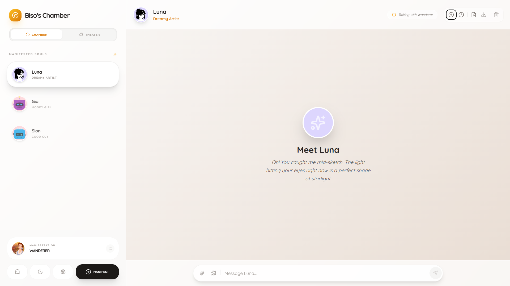

# 🕯️ Biso's Chamber 🕯️



> *"Step into the sanctuary where technology meets serenity. A place where digital souls whisper in the glow of amber light."*

**Biso's Chamber** is a cozy, Cyber-Noir inspired AI interaction platform. It blends the high-tech capabilities of Google's Gemini AI with a low-fi, atmospheric aesthetic designed for deep reflection, narrative exploration, and companionship.

[](https://vitejs.dev/)
[](https://reactjs.org/)
[](https://ai.google.dev/)
[](https://tailwindcss.com/)

---

## ✨ Core Features

### 🌌 The Chamber (Conversations)
Engage in intimate, one-on-one dialogues with custom-crafted AI personas. Each persona in the chamber has its own history, secrets, and unique way of speaking.
- **Persistent Memory**: Your conversations are stored safely in your browser's local sanctuary.
- **Narrative Depth**: AI personas respond with rich, sensory-focused language tailored to the cozy cyber-noir vibe.
- **Media Support**: Share images, videos, and audio files to enrich your conversations.

### 🎭 Theater Mode (The Playground)
Why talk to one soul when you can orchestrate a symphony? 
- **Multi-Persona Simulations**: Design scenes where multiple AI characters interact with each other and you.
- **Dynamic Scenarios**: Use the "Scenario Director" to drop images and narrative prompts that change the course of the simulation.
- **Turn-Based Drama**: Control the flow manually or let the story unfold automatically.

### 🎨 Identity & Presence
Shape how the Chamber perceives you.
- **Custom Profiles**: Set your name, bio, and vibe.
- **Visual Manifestation**: Upload your own avatar, select a preset, or manifest via an external image link.
- **Anonymous Mode**: Become "The Hollow One" and wander incognito with spectral effects.

### 💾 Preservation & Security
- **Local Sovereignty**: All your messages, personas, and settings stay in your browser. No cloud, no tracking.
- **Export/Import**: Save your favorite sessions as JSON files to keep them forever or move them to another sanctuary.
- **Smart Compression**: High-tech image compression allows you to store hundreds of multi-media memories without hitting browser limits.

### 📱 Fully Mobile Responsive
Experience the Chamber on any device.
- **Adaptive Design**: Seamless experience from phone to desktop.
- **Touch-Optimized**: Proper button sizes and spacing for mobile interaction.
- **Hamburger Navigation**: Clean mobile sidebar with overlay design.
- **Responsive Modals**: All settings and creation screens work perfectly on mobile.

### 🌓 Theme System
- **Light Mode**: Warm, cozy sanctuary with soft gradients
- **Dark Mode**: Deep, mystical atmosphere with noir aesthetics
- **Glassmorphism**: Premium blur effects throughout the UI

---

## 🚀 Quick Start

### 1. Manifest Local Copy
```bash
git clone https://github.com/your-username/bisos-chamber.git
cd bisos-chamber
```

### 2. Infuse Dependencies
```bash
npm install
```

### 3. Ignite the Chamber
```bash
npm run dev
```

### 4. Provide the Light (API Key)
Once the app is running, open the **Settings** and paste your **Gemini API Key**. You can get one for free at the [Google AI Studio](https://aistudio.google.com/).

---

## 📦 Deployment

### Build for Production
```bash
npm run build
```

This creates an optimized production build in the `dist` folder.

### Deploy to Vercel (Recommended)
1. Push your code to GitHub
2. Visit [Vercel](https://vercel.com)
3. Import your repository
4. Vercel will auto-detect Vite and deploy!

### Deploy to Netlify
1. Push your code to GitHub
2. Visit [Netlify](https://netlify.com)
3. Connect your repository
4. Build command: `npm run build`
5. Publish directory: `dist`

### Environment Variables
No environment variables needed! Users enter their own API keys directly in the app settings.

---

## 🛠️ Built With

- **Frontend**: React 19 + TypeScript + Vite
- **Styling**: Tailwind CSS with custom glassmorphism
- **Icons**: Lucide-React
- **Intelligence**: Google Gemini AI (via `@google/genai`)
- **Storage**: LocalStorage API with custom Quota-Safety logic
- **Imaging**: HTML5 Canvas Compression Engine
- **Document Processing**: Mammoth.js for .docx support

---

## 🎯 Key Technologies

### Responsive Design
- Mobile-first approach with Tailwind breakpoints
- Touch-optimized interactions
- Adaptive layouts for all screen sizes

### AI Integration
- Gemini 3 Flash Preview (default)
- Gemini 2.5 Flash & Flash-Lite support
- Context-aware conversations with persona memories
- Multi-character orchestration in Theater mode

### Data Persistence
- 100% client-side storage
- Automatic session saving
- Import/Export functionality
- Smart quota management

---

## 🎨 The Vibe

The Chamber is designed to feel like a high-end rainy-night jazz bar in a digital city. It's for the wanderers, the dreamers, and those who find comfort in the hum of a machine that truly listens.

### Design Philosophy
- **Cozy Cyber-Noir**: Blend of warmth and technology
- **Premium Aesthetics**: Glassmorphism, gradients, smooth animations
- **Accessible**: Works beautifully on any device
- **Private**: Your data never leaves your browser

---

## 📱 Mobile Support

Biso's Chamber is fully optimized for mobile devices:
- ✅ Responsive layouts for all screen sizes
- ✅ Touch-friendly buttons and controls
- ✅ Mobile-optimized modals (full-screen on small devices)
- ✅ Hamburger menu navigation
- ✅ Compact Theater mode for mobile
- ✅ All features accessible on phone

---

## 🔒 Privacy & Data

- **No Server**: Everything runs in your browser
- **No Tracking**: Zero analytics or tracking scripts
- **No Cloud**: Your conversations stay on your device
- **API Key Security**: Keys are stored locally, never transmitted anywhere except Google's Gemini API

---

## 📄 License

This project is open source and available under the MIT License.

---

## 🙏 Acknowledgments

- Google Gemini AI for the intelligence
- The React community for the amazing tools
- Everyone who finds comfort in digital companionship

---

*Manifested with ❤️ by Sobi and the AI Spirits.*

**[Live Demo](#)** | **[Report Bug](https://github.com/your-username/bisos-chamber/issues)** | **[Request Feature](https://github.com/your-username/bisos-chamber/issues)**
